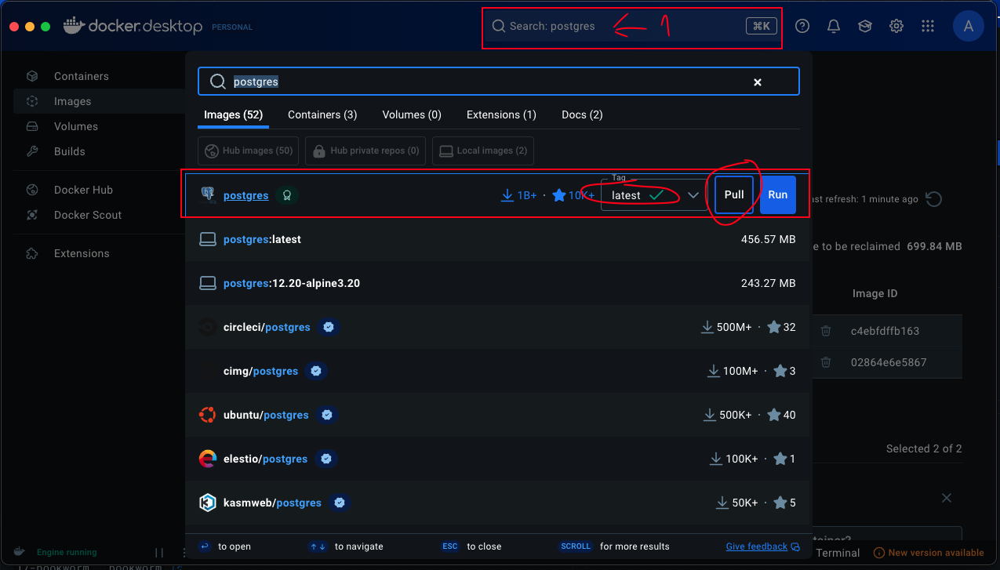
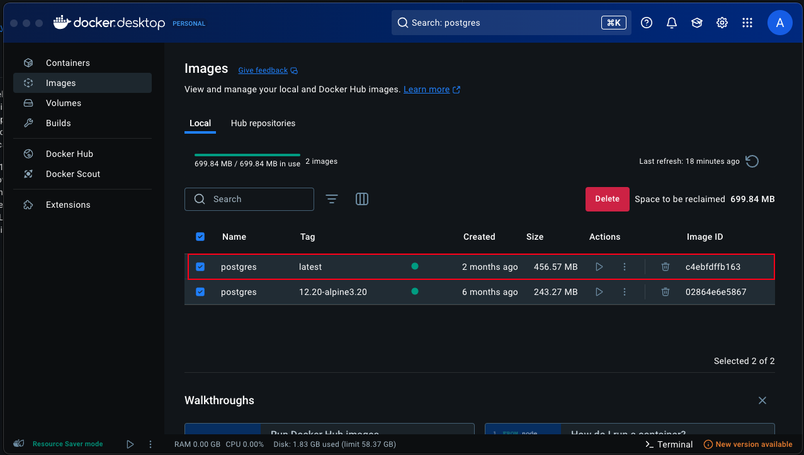
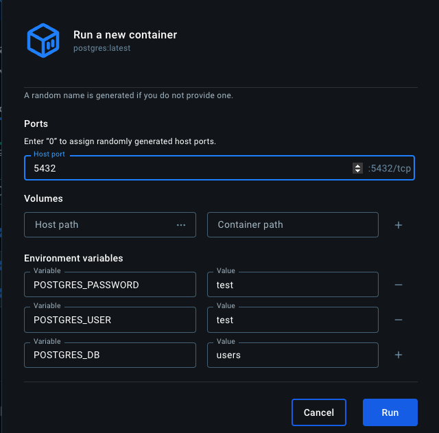
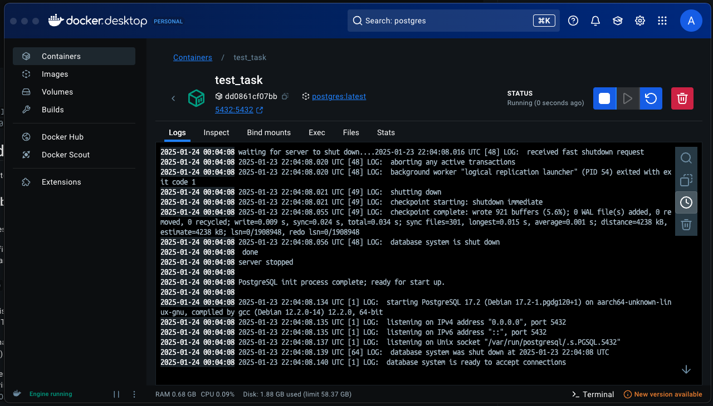
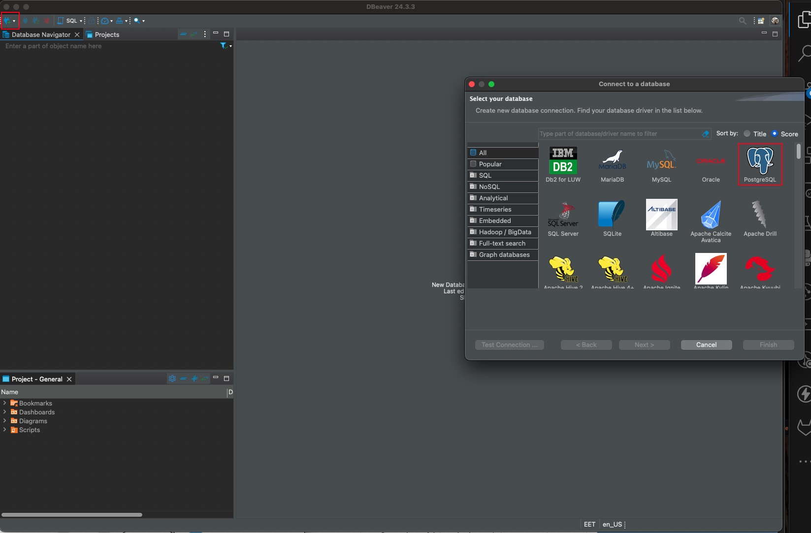
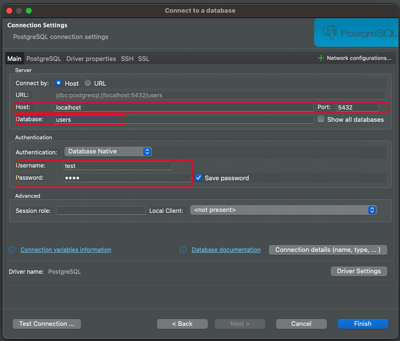
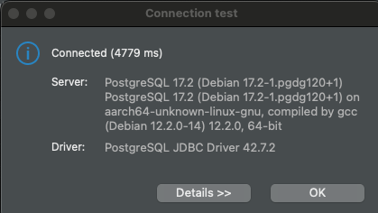

# Äriinfosüsteemide peakasutaja - Proovitöö

## Kirjeldus

Proovitöö eesmärk on hinnata kandidaadi SQL kasutamise oskusi. Kuna vead võivad olla seotud andmetega, tuleb aeg-ajalt analüüsida kasutajaliideses nähtut ja andmebaasis toimuvat. Meie kasutatav andmebaas on PostgreSQL, kus olemite vahelised seosed on viidud koodi tasemele. See tähendab, et PostgreSQL toimib peamiselt NoSQL põhimõtetel.

Ülesannetes on loodud andmebaasi skeem (schema), mille kandidaat peab enda lokaalses seadmes käivitama ja seejärel lisama sinna ka andmed. Andmebaasi dump asub failis `user.sql`. Andmebaasi küsitlused (queryd) palume luua faili `sample.sql`, kus on ka ülesande kirjeldused ja oodatavad tulemused.

**NB!** Dumpis kasutatud andmed on juhuslikult genereeritud ning ei ole seotud päris isikutega.

**DANGER:** siin tavapärane syntax ei tööta. Pead kasutama JSON operaatoreid. Loe näiteid siit: [PostgreSQL JSON funktsioonid](https://www.postgresql.org/docs/9.3/functions-json.html).

## Andmebaasi ülesseadmine

Kuna me ei eelda, et kandidaadil on süvateadmised Dockeri ja selle kasutamise kohta, anname juhised, kuidas kiiresti ja lihtsasti lahendus tööle panna. Selleks on vaja Docker Desktopi ja mõnda DBMS-rakendust.

**Võib kasutada ka enda loodud andmebaasi ning ei pea jälgima meie soovitusi. Peaasi, et saad probleemi lahendatud.**

### Soovituslik videoõpetus

Kui oled edasijõudnu, siis selle osa võid vahele jätta.

Harimise eesmärgil võib vaadata antud 10-minutilist tutvustavat videot: [YouTube - Docker Basics](https://youtu.be/RdPYA-wDhTA?si=COUhqmJm3CJsqAa4).

Lugemist Dockeri kohta: [Docker e-raamat](https://github.com/bobbyiliev/introduction-to-docker-ebook).

### Sammud:

#### Vajalikud tööriistad
1. **Laadi oma seadmesse Docker:**
   [Laadi alla Docker Desktop](https://www.docker.com/products/docker-desktop/)

2. **DBMS-i jaoks soovitame DBeaver-it:**
   [Laadi alla DBeaver](https://dbeaver.io/)

#### Ülesseadmine

1. Käivita Docker Desktop ning otsi PostgreSQL image ja lae alla.

   

2. Käivita image.

   

   Peaks avanema järgmine vaade:

   

3. Sea järgmised parameetrid:
   - **Container name** - anna suvaline nimi.
   - **Ports** - PostgreSQL vaikimisi kasutatav port on 5432, see tuleb määrata.
   - **Volumes** - kui soovid eraldada eraldi ketast, võib selle jätta täitmata.
   - **Environment variables** - neid mitte täites lisatakse vaikeväärtused, kuid selguse mõttes soovitame lisada:
     - `POSTGRES_PASSWORD`
     - `POSTGRES_USER`
     - `POSTGRES_DB`

   

4. Kui see osa on tehtud, vajuta **Run** ning peaksid nägema, et Dockeri konteiner töötab ootuspäraselt.

   

#### Andmebaasi ühendamine DBMS abil

1. Loo ühendus:

   

2. Täida eelnevalt sisestatud muutujaid:

   

3. Testi ühendust:

   

Kui said selle teate, siis oled juhendi järgi kõik korrektselt sooritanud. Edasine on juba lihtne.
